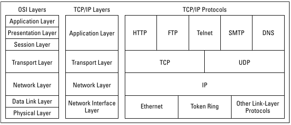
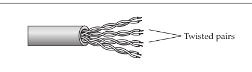
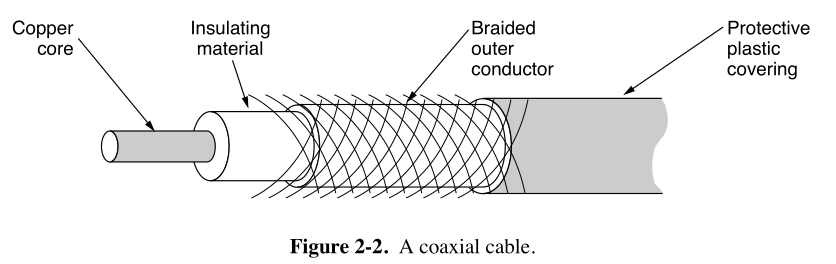
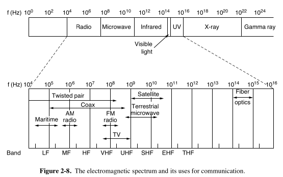

## Pre-Pre-Networking Era - 1800s - Great Age of Invention

- History of Networking - The Pre-Pre Netowrking Era - 1800s - Great Age of Invention
    - Telegraph: The Birth of Long-Distance Networking
        - Commercialized by Samuel Morse in 1840s.
        - Solved the base need of networking - Long distance communication
        - Worked by sending electric signals on copper wires
            - Sent encoded electrical signals (Morse code or needle deflections)
        - Allowed fast, repeatable communication
        - Telegraph networks expanded rapidly:
            - 1858: First transatlantic cable connected Europe and North America.
            - Led to the rise of international communication, which laid the foundation for global networking.
        - Helped in laying foundation for modern networking
            - Protocol standardization started with this.
            - Concepts like encoding, transmission, reception, and even packet switching (breaking data into parts) trace roots to telegraphy.
    - Fax Machine was concetualized in 1843, used telegraph communication basis.

    - TelePhone
        - 1876 - Graham bell invented telephone
        - Used same network as telegraph
        - Transmitter and Receiver were built using diaphragm

    - Early 1900s, AT&T built global wired networks

    - Wireless Telegraphy (1890s): Guglielmo Marconi’s radio telegraphy sent Morse code over radio waves, freeing communication from physical wires. He further proved Transatlantic Radio Transmission in 1901
    - Radio and Television (1920s–1940s): Radio broadcasting (1920) and television (1925) sent audio and video wirelessly to mass audiences

- Why copper wires, due to its properties
    - Excellent Electrical Conductivity
    - Malleability and Ductility
    - Corrosion Resistance
    - Reliability and Durability
    - Cost-Effective
    - Alternatives - silver, aluminium

## Digital Computing history

- Alan Turing wrote paper on Turing machine in 1936
    - the Turing machine is a theoretical model of computation. It was designed to formalize the concept of what it means to "compute" something — long before real computers existed.
    - Turing showed that any computation that can be performed algorithmically can be done by this simple machine.
    - It laid the foundation for computer science, programming languages, and the design of CPUs — all of which boil down to manipulating 0s and 1s in structured ways.
    - Components of a Turing Machine:
        - An infinite tape divided into cells (like memory), each cell holding a symbol (like 0 or 1).
        - A tape head that can read and write symbols, and move left or right.
        - A finite set of states that guide what the machine should do based on the current symbol and state.

- ENIAC (1945): The first general-purpose electronic computer, followed by EDVAC (1949), which implemented stored-program design.
    - It was designed to perform complex calculations faster than any mechanical machine before it.
    - Used 18000 vacuum tubes
    - A vacuum tube is a sealed glass or metal container that allows the controlled flow of electrons in a vacuum
- Transistors: Invented in 1947 at Bell Labs, replacing vacuum tubes, leading to smaller, reliable computers (e.g., IBM 700 series).
- Commercial Computers: UNIVAC I (1951) became the first commercially successful computer. IBM dominated with mainframes like the IBM 7090.
- Silicon Revolution: Jack Kilby and Robert Noyce developed integrated circuits (ICs) in 1958-1959, enabling compact, powerful computers.
    - It marks the transition from bulky vacuum tube electronics to compact, efficient silicon chips, enabling the digital age we live in today.
    - Why silicon
        - Abundant: Silicon is the second most abundant element in Earth’s crust.
        - Semiconducting Properties: Can conduct electricity under certain conditions, ideal for making transistors.
        - Stable & Durable: Handles heat and voltage variations better than alternatives like germanium.

- Intel 4004 (1971): The first microprocessor, packing a CPU onto a chip.

## Networing History

- Sputnik 1, launched by the Soviet Union on October 4, 1957, was the world’s first artificial satellite and marked the beginning of both the space age and the satellite era. Its primary communication function was to transmit periodic radio pulses back to Earth, which could be received by radio operators worldwide
- In 1958, US forms ARPA (Advanced Research Projects Agency) and NASA
- 1962: MIT publishes memos describing the “Intergalactic Computer Network.” ARPA (Advanced Research Projects Agency), promoting the idea of a connected computer network.
- 1965: Thomas Merrill and Lawrence Roberts link computers in Massachusetts and California via a telephone line using packet switching—a major shift from traditional circuit switching. - first WAN
    - Circuit Switiching - Traditional Telephone Model
        - A dedicated communication path is established between two devices (e.g., during a phone call). That path stays reserved for the entire duration of the session. Data is sent as a continuous stream over the same route.
    - Packet Switching (Used in the Internet & Data Networks)
        - Data is broken into small packets, each labeled with destination and sequence info. Packets travel independently across the network using the most efficient routes. They’re reassembled in the correct order at the destination.
- 1966–1969: ARPA (Advance Research Projects Agency) funds the development of a resilient computer network. One of the first projects released was TRANSIT, a satallite navigation system used for tracking UC Navy Ships and submarines. This system was a precursor to our current Global Postioning System (GPS)
- 1969: ARPANET launches, connecting: UCLA (Leonard Kleinrock), Stanford Research Institute (SRI), UC Santa Barbara, University of Utah. 
    - First message sent: “LO” (intended to be “LOGIN” but crashed after two characters).
    - The subnet would consist of minicomputers called IMPs (Interface Message Processors) connected by then state of the art 56-kbps transmission lines.
    - For reliablity, each IMP would be connected to two other IMPs atleast.
    - Each node of the network was to consist of an IMP and a host. A host would send messages up to 8063 bits to its IMP which would then break these up into packets of at most 1008 bits and forward them independently toward the destination.
    - In addition to helping the fledgling ARPANET grow, ARPA also funded research on the use of satellite networks and mobile packet radio networks.
- 1973–1974: Vint Cerf and Bob Kahn develop TCP/IP (Transmission Control Protocol/Internet Protocol), designed to enable inter-network communication between different systems.
    - Before this NCP (Network Control Protocol) as used in ARPANET, but it couldn’t scale to interconnect different networks. High level protocol built on top of NCP were:
        - FTP               Still used in TCP
        - Telnet            Mostly replaced by ssh
        - Email             SMTP Precursor
    - IMP (Interface Message Processor) nodes handled the modem connections. In IMP you have to manually assign host numbers (no IP Addresses, Manual Addressing). There were no retry for packets as IMPs were trusted.
- In 1976, Xerox develops Ethernet (by Bob Metcalfe), allowing high-speed wired connections and revolutionizing local area networks (LANs).
- 1979: 
    - ARPANET connects to networks in the UK and Norway—beginning international expansion.
    - Usenet (user network) is created - a decentralized messaging/discussion system
        - Used UUCP (unix-to-unix-copy) protocol and switched to NNTP (Network news transfer protocol) later from 1986 onwards
        - UUCP
            - Allowed Unix systems to exchange files/emails over dial up modem links
            - How usenet used it
                - servers called each other at scheduled times
                - Batch transfers: Downloaded all new messages in one go
                - no real time updates - delays of hours or days were normal
        - NNTP
            - Was based on TCP/IP
            - How it worked 
                - Users connected to NNTP Server (eg. news.example.com)
                - Servers synced with peers via push/pull over TCP/IP
            - Impact: NNTP’s design influenced modern forums (Reddit, Mastodon).
- The International Organization for Standardization (ISO) recognized the chaos of incompatible networks.
    - Goal: Create a universal reference model to ensure interoperability.                
- 1980 
    - ARPANET connects to networks in the UK and Norway—beginning international expansion.
    - OSI (Open System Interconnection) model is proposed by ISO - a 7 layer reference model for network communication
- 1983:
    - ARPANET officially adopts TCP/IP, marking the technical start of the Internet.
    - The Domain Name System (DNS) is introduced, replacing numeric IPs with human-readable names.
        - By 1984, the flip from hosts to domain begin with RFC 920, which made the first use of "the Dot" structure.
    - Flag Day of the internet - 1st Jan - 1983
        - ?
    - IANA (Internet Assigned Numbers Authority) was formed 
        
        |Responsibility |	            Description|
        |---------------|---------------------------|
        |IP Address Allocation |	    Assigning blocks of IP addresses to different ARPANET-connected hosts.|
        |Protocol Number Assignments |	Maintaining a registry of protocol numbers used by TCP/IP (e.g., ICMP, UDP).|
        |Port Number Registry	 |   Assigning well-known port numbers (e.g., port 80 for HTTP).|
        |Parameter Coordination	 |   Ensuring that parameters used in protocols (like protocol IDs) did not conflict. |
        |Publishing RFCs	     |       Jon Postel was also the editor of the RFC (Request for Comments) series, where many standards were documented.|

- 1984: Number of hosts exceeds 1,000.
- 1985: NSFNET is established to connect research universities — it will eventually evolve into the modern internet backbone.
    - NSFNET (National Science Foundation Network) provided better physical infrastructure compared to network of ARPANET
    - ARPANET was originally built by DARPA for military and research use only. As the internet grew, a more public, academic-friendly network was needed. ARPANET was decommisioned by 1990
    - NSFNET encouraged broader, open access to networking for researchers, educators, and eventually the public.
    - NSFNET used dedicated digital circuits leased from telephone companies, These were not dial-up lines, but permanent leased data lines, forming the backbone interconnect.
- 1988 - The Morris Worm, the first major internet worm, disrupts 10% of connected hosts — leads to the formation of CERT (Computer Emergency Response Team)
    - Intent: He claimed he created the worm to measure the size of the Internet, not to cause harm.
    - Flaw: A design error caused it to replicate excessively, which crashed many systems.
    - exploited three vulnerabilities in Unix systems
        - Sendmail Debug Mode (a mail server flaw allowing remote execution).
        - Fingerd Buffer Overflow (a bug in the finger user-info service).
        - Weak Passwords (it tried common passwords via rsh).
    - Once inside a system, it:
        - Copied itself to new machines.
        - Disguised its processes (renamed itself to avoid detection).
        - Re-infected already-infected machines (a design flaw that caused overload).
    - First felony conviction under the CFAA (Computer Fraud and Abuse Act) (Morris got 3 years probation + a fine).
    - Fun Fact: Robert Morris later became a respected MIT professor and co-founder of Y Combinator.
- 1990:
    - ARPANET is formally decommissioned.
    - Tim Berners-Lee at CERN develops the World Wide Web, HTML, HTTP, and the first browser.
- 1991:
    - NSF lifts restrictions on commercial use of the internet.
    - The web becomes publicly available.
- 1992
    - IETF (Internet Engineering Task Force) is formed to Develop open standards for the internet (e.g., TCP/IP, HTTP).
        - ?
- 1994–1995:
    - Netscape Navigator, Yahoo!, Amazon, and eBay launch.
    - SSL (Secure Sockets Layer) developed for secure web communication.
    - NSFNET decommissioned — commercial ISPs take over backbone services.
- 1996: Hotmail launches; VoIP begins appearing.
- 1997: Wi-Fi (IEEE 802.11) is introduced.
- 1998:
    - Google is founded.
    - ICANN (Internet Corporation for Assigned Names and Numbers) is created to manage DNS and IP address allocations.

- 2000s:
    Broadband (DSL/Cable) replaces dial-up.
    Wi-Fi (802.11b/g) becomes mainstream.
    3G mobile networks enable smartphones (iPhone launches in 2007).

- 2010s:
    4G LTE delivers mobile streaming.
    Cloud computing (AWS, Azure) transforms IT infrastructure.
    Social media (Facebook, Twitter, Instagram) dominates communication.

- 2020s:

    5G networks enable ultra-low latency (1ms) and gigabit speeds.
    Edge computing reduces cloud dependency.
        - Edge computing is a distributed computing model that processes data closer to its source (e.g., IoT devices, sensors, or local servers) instead of sending it to a centralized cloud data center. This reduces latency, bandwidth use, and reliance on distant servers.
    AI-driven networks optimize traffic (e.g., Google’s BBR congestion control).

- Future:
    Quantum networking (unhackable communication via quantum entanglement).
    6G (2030s?) – Potential terabit speeds and holographic communication.

Computer Networks classification based on Geographic Coverage
(a) Personal Area Network (PAN)
        Coverage: Very small area (a few meters).
        Example: Bluetooth, USB connections, smartwatches.

(b) Local Area Network (LAN)
        Coverage: Small area (home, office, school).
        Example: Ethernet, Wi-Fi in a building.

(c) Metropolitan Area Network (MAN)
        Coverage: A city or large campus.
        Example: Cable TV networks, city-wide Wi-Fi.

(d) Wide Area Network (WAN)
        Coverage: Large geographic area (countries, continents).
        Example: The Internet, corporate global networks, Cellular network.

(e) Campus Area Network (CAN)
        Coverage: University or corporate campus.
        Example: Interconnected LANs in a university.

## Internet Architecture - How Data Travels

### TCP/IP Model and OSI Model

- 
- There are 3 concepts that are central to OSI Model
    - Services
        - Each layer performs some services for the layer above it. Ther services definition tells what the layer does, not how entities above it access it or how the layer works. It defines layer's semantics.
    - Interfaces
        - A layer's interface tells the processes above it how to access it. It specifies what the parameters are and what results to expect. It, too, says nothing about how the layer works inside.
    - Protocols
        - the peer protocols used in a layer are the layer's own business. It can use any protocols it wants to, as long as it gets the job done (i.e., provides the offered services). It can also change them at will without affecting software in higher layers.

| Aspect |	OSI Model |	TCP/IP Model |
|------------|--------|----------------|
|Layer Count |	7 layers (more detailed). |	4 layers (simpler). |
|Development |	Designed top-down (theoretical).	| Evolved bottom-up (practical). |
|Adoption |	Rarely implemented fully; used for learning. |	Basis of the internet (real-world use).|
|Flexibility |	Strict separation of layers. |	Looser layer boundaries (e.g., Application layer combines 3 OSI layers).|
|Protocols |	Generic (not tied to specific tech). |	Directly tied to TCP, IP, HTTP, etc.|

- Why TCP/IP "Won" Over OSI
    - Already in Use – TCP/IP was powering ARPANET (precursor to the internet) before OSI was finalized.
    - Simpler Structure – Fewer layers made TCP/IP easier to implement.
    - Backed by the U.S. Government – ARPANET’s success led to TCP/IP becoming the de facto standard.
    - OSI Was Too Complex – Vendors found it hard to implement all 7 layers strictly.

## TCP/IP Model and OSI Model

- Sender Side: Example sending a POST request to an HTTPS webpage
    - Layer 7 - Application
        - POST request with JSON data to HTTPS server  
    - Layer 6 - Presentation
        - Serialize JSON to flat byte strings
    - Layer 5 - Session
        - Request to establish TCP connection/TLS 
    - Layer 4 - Transport
        - Sends SYN request target port 443
    - Layer 3 - Network
        - SYN is placed an IP packet(s) and adds the source/dest IPs 
    - Layer 2 - Data link 
        - Each packet goes into a single frame and adds the source/dest MAC addresses
    - Layer 1 - Physical
        - Each frame becomes string of bits which converted into either a radio signal (wifi), electric signal (ethernet), or light (fiber) 

- Receiver Side: Receiver computer receives the POST request the other way around 
    - Layer 1 - Physical 
        - Radio, electric or light is received and converted into digital bits
    - Layer 2 - Data link 
        - The bits from Layer 1 is assembled into frames
    - Layer 3 - Network
        - The frames from layer 2 are assembled into IP packet. 
    - Layer 4 - Transport
        - The IP packets from layer 3 are assembled into TCP segments
        - Deals with Congestion control/flow control/retransmission in case of TCP
        - If Segment is SYN we don’t need to go further into more layers as we are still processing the connection request
    - Layer 5 - Session
        - The connection session is established or identified
        - We only arrive at this layer when necessary (three way handshake is done)
    - Layer 6 - Presentation
        - Deserialize flat byte strings back to JSON for the app to consume
    - Layer 7 - Application
        - Application understands the JSON POST request and your express json or apache request receive event is triggered

### Network interface layer (OSI Model: Physical Layer)

- Describes the mechanical and electrical details of network components such as cables, connectors, and network interfaces. The physical layer is concerned with transmitting raw bits over a communication channel. The design issues have to do with making sure that when one side sends a 1 bit, it is received by the other side as a 1 bit, not as a 0 bit. Typical questions here are how many volts should be used to represent a 1 and how many for a 0, how many nanoseconds a bit lasts, whether transmission may proceed simultaneously in both directions, how the initial connection is established and how it is torn down when both sides are finished, and how many pins the network connector has and what each pin is used for. The design issues here largely deal with mechanical, electrical, and timing interfaces, and the physical transmission medium, which lies below the physical layer.
- It deals ONLY with the transmission and reception of raw binary data (0s and 1s) over a physical medium (like cables, fiber optics, or airwaves). Devices like Hubs, Repeaters, Network Interface Cards (NICs), Modems (partly)
    | Responsibility |	Details|
    |----------------|---------|
    | Bit Transmission |	Converts binary data into signals suitable for the medium (electrical, light, or radio waves).|
    | Physical Medium Attachment |	Defines how devices are physically connected (e.g., type of cable, connector pins).|
    | Signal Encoding |	Defines how 0s and 1s are represented (e.g., voltage levels, light pulses, radio frequency).|
    | Data Rate Control |	Determines how fast bits are transmitted (measured in bits per second - bps).|
    | Synchronization |	Makes sure the sender and receiver are synchronized at the bit level (timing!).|
    | Topology Definition |	Defines the physical layout of devices and cables (e.g., star, bus, ring topologies).|
    | Transmission Mode |	Defines directionality: Simplex (one way), Half-Duplex (both ways, but one at a time), Full-Duplex (both ways simultaneously).|

- 3 kinds of transimission media
    - Guided or wired
        - Each type of guided transmission media has its own set of trade-offs in terms of frequency, bandwidth, delay, cost, and ease of installation and maintenance. Bandwidth is a measure of the carrying capacity of a medium. It is measured in Hz (data/sec). This contains
            - Persistent storage eg hard disks
                - Never underestimate the bandwidth of a station wagon full of tapes hurtling down the highway.
            
            - Twisted pairs: The King of Network Cables
                - A twisted pair consists of two insulated copper wires, typically about 1 mm thick. The wires are twisted together in a helical form, similar to a DNA molecule.
                - - Why Twist the Wires?
                    - When electrical current flows through a wire, it creates an electromagnetic field. This can cause two types of problems:
                        - Crosstalk: Signal from one wire interferes with another nearby wire.
                        - External Interference: Radio signals, electrical devices, or even lightning can induce noise into the cable.
                                    
                    - Twisting the pair ensures that interference affects both wires equally, canceling out the noise when the signal is received.
                    - This technique is called common-mode rejection.
                    - Two parallel wires constitute a fine antenna; when the wires are twisted, the waves from different twists cancel out, so the wire radiates less effectively
                - More Twists = Less Interference
                - A signal is usually carried as the difference in voltage between the two wires in the pair.
                - The bandwidth depends on the thickness of the wire and the distance traveled, but hundreds of megabits/sec can be achieved for a few kilometers
                - A Category 5e twisted pair consists of two insulated wires gently twisted together. Four such pairs are typically grouped in a plastic sheath to protect the wires and keep them together.

                - 

                - Different LAN standards may use the twisted pairs differently. For example, 100-Mbps Ethernet uses two (out of the four) pairs, one pair for each direction. To reach higher speeds, 1-Gbps Ethernet uses all four pairs in both directions simultaneously, which requires the receiver to factor out the signal that is transmitted.
                - Most communications and network devices, including those designed to use RJ-45 connectors, are either data communications equipment (DCE) or data terminal equipment (DTE).
                - The RJ-45 jack on a hub or switch is DCE, while the RJ-45 jack on a computer’s NIC is DTE. Note that you cannot communicate between DCE and DCE devices or between DTE and DTE devices using a standard twisted-pair/RJ-45 cable that has been wired

            - Co-Axial Cable
                - A coaxial cable (or co-ax) is a type of electrical transmission line used to carry high-frequency signals with low interference and signal loss. It is widely used in TV, internet (cable broadband), radio, and CCTV systems.
                - 
                
            
            - Power Lines
                - Power lines have been used by electricity companies for low-rate communication such as remote metering for many years, as well in the home to control devices

            - Fiber Optics
                - Fiber-optic cable uses a glass strand and carries the data signals as light instead of electricity.
                - In contrast, the achievable bandwidth with fiber technology is in excess of 50,000 Gbps (50 Tbps)
                - The current practical limit of around 100 Gbps is simply due to our inability to convert between electrical and optical signals any faster. To build higher-capacity links, many channels are simply carried in parallel over a single fiber.
                - 

                Structure of an Optical Fibre:
                    Core: Thin glass/plastic centre where light travels (high refractive index).
                    Cladding: Outer layer with a lower refractive index to enable TIR.
                    Buffer Coating: Protective outer layer.
                - Refraction is the bending of light as it passes from one medium to another with a different optical density (refractive index). This occurs because light changes speed when moving between media.
                The degree of bending is governed by Snell’s Law:
                n1 sin(d1) = n2 sin(d2)

                - Due to the low attenuation (signal loss) in fibre , repeaters are needed only about every 50 km on long lines, versus about every 5 km for copper,

                | Feature              | Twisted Pair       | Coaxial Cable      | Fiber Optic Cable     |
                |----------------------|--------------------|---------------------|------------------------|
                | Medium               | Copper (twisted)   | Copper + Shielding  | Glass/Plastic (optical)|
                | Signal Type          | Electrical          | Electrical           | Light (Optical)        |
                | Speed/Bandwidth      | Up to 10 Gbps       | Up to 1 Gbps         | 100 Gbps+              |
                | Max Distance         | ~100 meters         | ~500 meters          | 10–100+ kilometers     |
                | Interference Resistance | Low–Moderate    | High                 | Very High              |
                | Cost                 | Low                 | Medium               | High                   |
                | Use Cases            | LAN, telephony      | TV, CCTV, cable net  | Backbone, ISPs, data centers |

        - Wireless
            - When electrons move, they create electromagnetic waves that can propagate through space (even in a vacuum). These waves were predicted by the British physicist James Clerk Maxwell in 1865 and first observed by the German physicist Heinrich Hertz in 1887
            - When an antenna of the appropriate size is attached to an electrical circuit, the electromagnetic waves can be broadcast efficiently and received by a receiver some distance away. All wireless communication is based on this principle.
            - 
            - 1 MHz = 10^6 Hz
            - The number of oscillations per second of a wave is called its frequency, f, and is measured in Hz. The distance between two consecutive maxima (or minima) is called the wavelength, which is universally designated by the Greek letter h (lambda).
            - Wireless communications use specific parts of this spectrum to carry data through the air — primarily radio waves and microwaves.
            - The biggest challenge concerning the electromagnetic spectrum concerns performing spectrum allocation efficiently and fairly. If multiple parties can transmit data in the same part of the spectrum in the same geographic region, there is significant potential for the communicating parties to interfere with one another.
            - Wireless communications use specific parts of this spectrum to carry data through the air — primarily radio waves and microwaves.
            | Band Name                 | Frequency Range | Characteristics                  | Examples                             |
            | ------------------------- | --------------- | -------------------------------- | ------------------------------------ |
            | **VLF/LF/MF**             | 3 kHz – 3 MHz   | Long range, low data rates       | Submarine comms, AM radio            |
            | **HF**                    | 3 – 30 MHz      | Medium range, atmospheric bounce | Shortwave radio                      |
            | **VHF/UHF**               | 30 MHz – 3 GHz  | Moderate range, better bandwidth | TV, FM radio, walkie-talkies, 2G, 3G |
            | **SHF (Microwave)**       | 3 – 30 GHz      | High-speed data, short range     | Wi-Fi, 4G/5G, radar, satellite       |
            | **EHF (Millimeter Wave)** | 30 – 300 GHz    | Ultra-fast, very short range     | 5G mmWave, experimental              |

            - How Data Is Sent Over Spectrum:
                When an electrical signal (e.g., 0s and 1s) is passed through an antenna:
                Electrons in the antenna vibrate at a certain frequency.
                This vibration emits electromagnetic radiation (a radio wave).
                The wave propagates outward from the antenna at the speed of light.

                At the receiving end:
                The incoming wave induces electron motion in the receiver’s antenna.
                This is converted back into an electrical signal, then demodulated to extract the original data.

                | Frequency           | Wavelength     | Characteristics                                                          |
                | ------------------- | -------------- | ------------------------------------------------------------------------ |
                | Low (e.g., 700 MHz) | Long (\~43 cm) | Travels farther, penetrates walls better                                 |
                | High (e.g., 28 GHz) | Short (\~1 cm) | Higher data rates, more capacity, but shorter range and blocked by walls |

        - Satellite
            - Satellite networking enables communication and internet access using orbiting satellites instead of traditional ground-based infrastructure like fiber or cell towers. It’s vital for remote areas, maritime, aviation, and global coverage.
                - Signal Sent from Earth (Uplink):
                Your device or dish sends data to the satellite using radio or microwave frequencies.
                Often via a modem connected to a satellite dish.
                - Satellite Receives and Relays Signal:
                Acts as a repeater or switch.
                Depending on the type, it might just bounce the signal back (bent-pipe) or process it onboard (smart satellites).
                - Signal Sent to Earth (Downlink):
                Satellite beams data to a ground station, which connects to the internet backbone or other networks.
                - Response Travels Back:
                The return data follows the same path in reverse: internet → ground station → satellite → your dish.

            - Used by starklink with leo, faster than fiber optics as light travel through glass vs air, weather
            - GPS
                - GPS works by measuring distances (not angles) to at least 4 satellites and using trilateration to calculate your position.
                - Satellites send signals:
                    - Each GPS satellite continuously broadcasts its exact time and location in orbit.
                    - These signals travel at the speed of light.
                - Your GPS receiver picks up the signals:
                    - It calculates how long each signal took to arrive.
                    - Using time × speed of light = distance, it knows how far it is from each satellite.
                - Trilateration determines your position:
                    - With distances to 3 satellites, your position is narrowed to two possible points.
                    - A 4th satellite eliminates ambiguity and corrects for clock error (since your phone’s clock isn't atomic-accurate).
                    - Trilateration is determined by checking the cross point of cricles of distances from each satellite

### Network interface layer (OSI Model: Data Link Layer)

- Describes the basic techniques that networks use to Network Infrastructure uniquely identify devices on the network (typically via a MAC address) and the means for one device to send information over the physical layer to another device, in the form of data packets. Switches operate at the data link layer, which means that they manage the efficient transmission of data packets from one device to another.
- The main task of the data link layer is to transform a raw transmission facility into a line that appears free of undetected transmission errors to the network layer. It accomplishes this task by having the sender break up the input data into data frames (typically a few hundred or a few thousand bytes) and transmit the frames sequentially. If the service is reliable, the receiver confirms correct receipt of each frame by sending back an acknowledgement frame. Another issue that arises in the data link layer (and most of the higher layers as well) is how to keep a fast transmitter from drowning a slow receiver in data. Some traffic regulation mechanism is often needed to let the transmitter know how much buffer space the receiver has at the moment. Frequently, this flow regulation and the error handling are integrated. Broadcast networks have an additional issue in the data link layer: how to control access to the shared channel. A special sublayer of the data link layer, the medium access control sublayer, deals with this problem.
- The principal service of the link layer is transferring data from the network layer on the source machine to the network layer on the destination machine.
- The Primary purpose is to transfer data frames between two nodes on the same physical link and ensure that the communication is reliable and error-free at that link level.
- the data link layer takes the packets it gets from the network layer and encapsulates them into frames for transmission

- For the most part, the link layer is implemented on a chip called the network adapter (Network Interface Card (NIC)), also sometimes known as a network interface controller (NIC). The network adapter implements many link layer services including framing, link access, error detection, and so on. Thus, much of a link-layer controller’s functionality is implemented in hardware.
- This framework makes use of the unique hardware addresses (MAC addresses) that are encoded on the card chip. The data-link protocol then uses the MAC addresses for the discovery of other systems situated on the network, to bring about data transfer in the right direction. The Network cards come in two types; the wired and the wireless network cards.
- 

- The data link layer can be designed to offer various services. The actual services that are offered vary from protocol to protocol. Three reasonable possibilities that we will consider in turn are:
    1. Unacknowledged connectionless service.
        - Unacknowledged connectionless service consists of having the source machine send independent frames to the destination machine without having the destination machine acknowledge them. Ethernet is a good example of a data link layer that provides this class of service.
    2. Acknowledged connectionless service. 
        - When this service is offered, there are still no logical connections used, but each frame sent is individually acknowledged. In this way, the sender knows whether a frame has arrived correctly or been lost. If it has not arrived within a specified time interval, it can be sent again. This service is useful over unreliable channels, such as wireless systems. 802.11 (WiFi) is a good example of this type of link layer service
    3. Acknowledged connection-oriented service.
        - With this service, the source and destination machines establish a connection before any data are transferred. Each frame sent over the connection is numbered, and the data link layer guarantees that each frame sent is indeed received. Furthermore, it guarantees that each frame is received exactly once and that all frames are received in the right order. Connection-oriented service thus provides the network layer processes with the equivalent of a reliable bit stream.
        - Occurs in 3 phases - connection is established, data is sent and connection is released

- Key Functions of data link layer
    - Framing
        - Breaking up the bit stream into frames is more difficult than it at first appears. A good design must make it easy for a receiver to find the start of new frames while using little of the channel bandwidth. We will look at four methods:
            1. Byte count.
                - 
                - Sending a frame back to the source asking for a retransmission does not help either, since the destination does not know how many bytes to skip over to get to the start of the retransmission. For this reason, the byte count method is rarely used by itself.
            2. Flag bytes with byte stuffing.
                - The second framing method gets around the problem of resynchronization after an error by having each frame start and end with special bytes. Often the same byte, called a flag byte, is used as both the starting and ending delimiter. This byte is shown in Fig. 3-4(a) as FLAG. Two consecutive flag bytes indicate the end of one frame and the start of the next. Thus, if the receiver ever loses synchronization, it can just search for two flag bytes to find the end of the current frame and the start of the next frame.
                - However, there is a still a problem left. It may happen that the flag byte occurs in the data, especially when binary data such as photos or songs are being transmitted. This situation would interfere with the framing. One way to solve this problem is to have the sender’s data link layer insert a special escape byte (ESC) just before each ‘‘accidental’’ flag byte in the data. Thus, a framing flag byte can be distinguished from one in the data by the absence or presence of an escape byte before it. The data link layer on the receiving end removes the escape bytes before giving the data to the network layer. This technique is called byte stuffing.
                - 
            3. Flag bits with bit stuffing.
                - Whenever the sender’s data link layer encounters five consecutive 1s in the data, it automatically stuffs a 0 bit into the outgoing bit stream. This bit stuffing is analogous to byte stuffing, in which an escape byte is stuffed into the outgoing character stream before a flag byte in the data. It also ensures a minimum density of transitions that help the physical layer maintain synchronization. USB (Universal Serial Bus) uses bit stuffing for this reason.
                - When the receiver sees five consecutive incoming 1 bits, followed by a 0 bit, it automatically destuffs (i.e., deletes) the 0 bit. Just as byte stuffing is completely transparent to the network layer in both computers, so is bit stuffing. If the user data contain the flag pattern, 01111110, this flag is transmitted as 011111010 but stored in the receiver’s memory as 01111110. The upper layers are completely unaware that bit stuffing is being used.
            4. Physical layer coding violations.
        - Many data link protocols use a combination of these methods for safety. 
        
    - Physical Addressing using MAC Address
        - A MAC (Media Access Control) address is a unique hardware identifier assigned to a device’s network interface (e.g., Wi-Fi card, Ethernet port). Unlike an IP address (which can change), a MAC address is permanently burned into the hardware by the manufacturer.
        - Format of a MAC Address
            - 48-bit hexadecimal number (12 digits).
            - Typically written as six pairs separated by colons or hyphens (e.g., 00:1A:2B:3C:4D:5E).
            - The first 3 pairs (OUI – Organizationally Unique Identifier) identify the manufacturer (e.g., 00:1A:2B = Intel).
            - The last 3 pairs are a unique device identifier.
        - Uses MAC (Media Access Control) addresses (e.g., 00:1A:2B:3C:4D:5E) to identify devices on a local network.
        - Ensures frames are delivered to the correct device within the same network segment.
        1. Device Identification on a Local Network
            Switches and routers use MAC addresses to direct traffic between devices on the same network (e.g., your laptop and printer in a home Wi-Fi network).

        2. Ethernet & Wi-Fi Communication
            Before data is sent over a network, devices use ARP (Address Resolution Protocol) to map IP addresses to MAC addresses.
            Example: When your PC sends data to your router, it uses the router’s MAC address (not just its IP).

        3. Network Security & Filtering
            MAC filtering allows networks to allow/block devices based on their MAC address (though this is not foolproof, as MAC addresses can be spoofed).
            Used in enterprise networks for device authentication.

        4. Preventing IP Conflicts
            DHCP servers use MAC addresses to assign the same IP to a device each time it reconnects.

        5. Tracking & Device Management
            ISPs and network admins can log devices connecting to a network.
            Used in smart home systems to recognize trusted devices.

    - Flow Control
        - what to do with a sender that systematically wants to transmit frames faster than the receiver can accept them
        - Prevents sender from overwhelming receiver by regulating data transmission speed.
            - Techniques:
                - Stop-and-Wait ARQ – Sender waits for acknowledgment before sending the next frame.
                - Sliding Window Protocol – Allows multiple frames in transit (e.g., Go-Back-N, Selective Repeat)

    - Error Detection and Correction
        - how to make sure all frames are eventually delivered to the network layer at the destination and in the proper order.
        - Timers and ack help in making sure all frames are delivered
        - One strategy is to include enough redundant information to enable the receiver to be able to deduce what the transmitted data must have been. The other is to include only enough redundancy to allow the receiver to deduce that an error has occurred (but not which error) and have it request a retransmission. The former strategy uses error-correcting codes and the latter uses error-detecting codes. The use of error-correcting codes is often referred to as FEC (Forward Error Correction).
        - On channels that are highly reliable, such as fiber, it is cheaper to use an error-detecting code and just retransmit the occasional block found to be faulty. However, on channels such as wireless links that make many errors, it is better to add redundancy to each block so that the receiver is able to figure out what the originally transmitted block was. FEC is used on noisy channels because retransmissions are just as likely to be in error as the first transmission.
        - One model is that errors are caused by extreme values of thermal noise that overwhelm the signal briefly and occasionally, giving rise to isolated single-bit errors. Another model is that errors tend to come in bursts rather than singly. This model follows from the physical processes that generate them—such as a deep fade on a wireless channel or transient electrical interference on a wired channel.
        - we cover these codes in the link layer because this is the first place that we have run up against the problem of reliably transmitting groups of bits. However, the codes are widely used because reliability is an overall concern. Error-correcting codes are also often seen in the physical layer, particularly for noisy channels, and in higher layers, particularly for real-time media and content distribution. Error-detecting codes are commonly used in link, network, and transport layers.
        - Error-Correcting Codes ??
            1. Hamming codes.
            2. Binary convolutional codes.
            3. Reed-Solomon codes.
            4. Low-Density Parity Check codes.
        - Error-Detecting Codes ??
            1. Parity.
            2. Checksums.
            3. Cyclic Redundancy Checks (CRCs).

    
    - Access Control (MAC Sublayer)
        Manages how devices share a communication medium (e.g., Ethernet, Wi-Fi).
        Two Main Approaches:
            - Controlled Access (e.g., Token Passing, Polling).
            - Random Access (e.g., CSMA/CD – Ethernet, CSMA/CA – Wi-Fi).
    
    - Sub-layers of the Data Link Layer ??
        The DLL is divided into two sub-layers:

        Sub-layer	Function	Examples
        Logical Link Control (LLC)	Manages flow control, error checking, and multiplexing different protocols.	Used in Ethernet, Wi-Fi (IEEE 802.2)
        Media Access Control (MAC)	Handles addressing (MAC) and channel access (CSMA/CD, CSMA/CA).

- Improving Efficiency
    - Bidirectional Transmission by Piggybacking
        - One way of achieving full-duplex data transmission is to run two instances of one of the previous protocols, each using a separate link for simplex data traffic (in different directions). Each link is then comprised of a ‘‘forward’’ channel (for data) and a ‘‘reverse’’ channel (for acknowledgements). In both cases, the capacity of the reverse channel is almost entirely wasted.
        - A better idea is to use the same link for data in both directions. After all, the reverse channel normally has the same capacity as the forward channel. In this model the data frames from A to B are intermixed with the acknowledgement frames from A to B.
        - Although interleaving data and control frames on the same link is a big improvement over having two separate physical links, yet another improvement is possible. When a data frame arrives, instead of immediately sending a separate control frame, the receiver restrains itself and waits until the network layer passes it the next packet. The acknowledgement is attached to the outgoing data frame (using the ack field in the frame header). In effect, the acknowledgement gets a free ride on the next outgoing data frame. The technique of temporarily delaying outgoing acknowledgements so that they can be hooked onto the next outgoing data frame is known as piggybacking.
    - Bidirectional Transmission by Sliding Windows ??

- Ethernet
    - Ethernet is most popular set of protocols for physical and data link layer. Ethernet comes in various speed versions:
        - Standard Ethernet
            - Used co-axial cable or unsheilded twisped-pair(UTP) cable. Runs at 10 Mbps.
        - Fast Ethernet
            - Runs at 100 Mbps. It uses two pairs of UTP cable, with at least Cat-5 cable.
        - Gigabit Ethernet
            - Runs at 1 Gbps or more. Two grade of cables are commonly used: cat-5e or cat-6.
    - A common pattern used for Ethernet and 802.11 is to have a frame begin with a well-defined pattern called a preamble. This pattern might be quite long (72 bits is typical for 802.11) to allow the receiver to prepare for an incoming packet. The preamble is then followed by a length (i.e., count) field in the header that is used to locate the end of the frame.
    - 

- Protocols & Technologies at the Data Link Layer
    Ethernet (IEEE 802.3) – Wired LAN technology.
    Wi-Fi (IEEE 802.11) – Wireless LAN technology.
    PPP (Point-to-Point Protocol) – Used in dial-up and DSL connections.
    HDLC (High-Level Data Link Control) – Used in leased-line connections.
    VLAN (Virtual LAN) – Logically segments networks at Layer 2.
    ARP (Address Resolution Protocol) – Maps IP to MAC addresses.

## Network Layer
- Handles the routing of data across networks. Routers operate at the network layer. The network layer handles the task of routing network messages from one computer to another. The two most popular layer 3 protocols are IP (which is usually paired with TCP) and IPX (typically paired with SPX for use with Novell and Windows networks).
- The network layer controls the operation of the subnet. A key design issue is determining how packets are routed from source to destination. Routes can be based on static tables that are ''wired into'' the network and rarely changed. They can also be determined at the start of each conversation, for example, a terminal session (e.g., a login to a remote machine). Finally, they can be highly dynamic, being determined anew for each packet, to reflect the current network load. If too many packets are present in the subnet at the same time, they will get in one another's way, forming bottlenecks. The control of such congestion also belongs to the network layer. More generally, the quality of service provided (delay, transit time, jitter, etc.) is also a network layer issue. When a packet has to travel from one network to another to get to its destination, many problems can arise. The addressing used by the second network may be different from the first one. The second one may not accept the packet at all because it is too large. The protocols may differ, and so on. It is up to the network layer to overcome all these problems to allow heterogeneous networks to be interconnected.
- Services offered by network layer:
    • Guaranteed delivery. This service guarantees that a packet sent by a source host will eventually arrive at the destination host.
    • Guaranteed delivery with bounded delay. This service not only guarantees delivery of the packet, but delivery within a specified host-to-host delay bound (for example, within 100 msec).
    • In-order packet delivery. This service guarantees that packets arrive at the destination in the order that they were sent.
    • Guaranteed minimal bandwidth. This network-layer service emulates the behavior of a transmission link of a specified bit rate (for example, 1 Mbps) between sending and receiving hosts. As long as the sending host transmits bits (as part of packets) at a rate below the specified bit rate, then all packets are eventually delivered to the destination host.
    • Security. The network layer could encrypt all datagrams at the source and decrypt them at the destination, thereby providing confidentiality to all transport-layer segments.
- Key Functions of the Network Layer
    1. Logical Addressing (IP Addressing)
        Uses IP addresses (IPv4: 192.168.1.1, IPv6: 2001:0db8::1) to uniquely identify devices globally.
        Differentiates between private (LAN) and public (Internet) addressing.
        Works with subnet masks to define network boundaries.

    2. Routing (Path Determination)
        Determines the best path for data packets using routing tables.
        Uses routing protocols like:
            - Static Routing (manually configured routes).
            - Dynamic Routing (automatically updates routes using protocols like OSPF, BGP, RIP).

    3. Packet Forwarding & Switching
        Moves packets from source to destination using:
            - Connectionless (Datagram) Approach (e.g., IP – best-effort delivery).
            - Connection-Oriented Approach (e.g., MPLS – ensures QoS).

    4. Fragmentation & Reassembly
        Breaks large packets into smaller MTU (Maximum Transmission Unit)-sized fragments if needed.
        Reassembles fragments at the destination.

    5. Congestion Control
        Manages network traffic to prevent overload (e.g., using ICMP Source Quench messages).

- It is sometimes useful to make a distinction between routing, which is making the decision which routes to use, and forwarding, which is what happens when a packet arrives. One can think of a router as having two processes inside it. One of them handles each packet as it arrives, looking up the outgoing line to use for it in the routing tables. This process is forwarding. The other process is responsible for filling in and updating the routing tables. That is where the routing algorithm comes into play.
- Routing - is the process of selecting the best path for data packets to travel from the source to the destination across multiple networks.
- Forwarding - is the actual movement of packets from an incoming interface to an outgoing interface based on the routing table.

- Implementation of connectionless service
    - If connectionless service is offered, packets are injected into the network individually and routed independently of each other. No advance setup is needed. In this context, the packets are frequently called datagrams (in analogy with telegrams) and the network is called a datagram network.

- Implementation of connection oriented service
    - a path from the source router all the way to the destination router must be established before any data packets can be sent. This connection is called a VC (Virtual Circuit), in analogy with the physical circuits set up by the (old) telephone system, and the network is called a virtual-circuit network.

- Routing Algorithms
    - routing packets from source machine to destination
    - The routing algorithm is that part of the network layer software responsible for deciding which output line an incoming packet should be transmitted on.
    - A graph is used to formulate routing problems.

    - Routing Algorithms: Static Routing 
        - These use manually configured routes and do not adapt to network changes.
        A. Shortest Path Routing
            - Uses a predefined shortest path (based on hops, cost, or bandwidth).
            - Example: Dijkstra’s Algorithm (used in OSPF).
        B. Flooding
            - Sends packets to all outgoing links except the incoming one.
            - Disadvantage: Causes high traffic (used only in specialized cases like wireless ad-hoc networks).
        C. Fixed Routing
            - Uses a static routing table (common in small networks).

    1. Shortest Path Algorithm - Dijkstra 
        - for static routing.
    2. Distance Vector Routing ??
        - for dynamic routing.
        - bellman form distributed algorithm
        - decenteralized routing algorithm. 
        - No node has complete information about the costs of all network links. Instead, each node begins with only the knowledge of the costs of its own directly attached links. Then, through an iterative process of calculation and exchange of information with its neighboring nodes, a node gradually calculates the least-cost path to a destination or set of destinations
        - each router maintains a routing table indexed by, and containing one entry for, each router in the network. This entry has two parts: the preferred outgoing line to use for that destination, and an estimate of the distance to that destination. 
        - The router is assumed to know the ‘‘distance’’ to each of its neighbors. If the metric is hops, the distance is just one hop. If the metric is propagation delay, the router can measure it directly with special ECHO packets that the receiver just timestamps and sends back as fast as it can.
    3. Link State Routing
        - for dynamic routing.
        - centeralized routing algorithm.
        - used in arpanet till 1979
        - algorithm has complete information about connectivity and link costs

- Routing Algorithms: Dynamic Routing   
    - Dynamic routing is a networking technique where routers automatically learn and update routing information using specialized protocols. Unlike static routing (which requires manual configuration), dynamic routing adapts to network topology changes in real-time, making it essential for large, complex networks.
    - Classification of Dynamic Routing Algorithms
        - By Operation Type
            - Distance Vector Algorithms
                - Bellman Ford 
                - Diffusing Update Algorithm (DUAL)
            - Link-State Algorithms
                - Dijkstra's Algorithm
                - IS-IS Algorithm
            - Path Vector Algorithms
                - Border Gateway Protocol (BGP) Algorithm
            - Hybrid Algorithms
                - EIGRP's DUAL
        - By Scope
            - Interior Gateway Protocols (IGPs) - For within an Autonomous System (AS)
            - Exterior Gateway Protocols (EGPs) - For between ASes

- In the network layer, the Internet can be viewed as a collection of networks or Autonomous Systems (ASes) that are interconnected. There is no real structure, but several major backbones exist. These are constructed from high-bandwidth lines and fast routers.
- The biggest of these backbones, to which everyone else connects to reach the rest of the Internet, are called Tier 1 networks. Attached to the backbones are ISPs (Internet Service Providers) that provide Internet access to homes and businesses, data centers and colocation facilities full of server machines, and regional (mid-level) networks. The data centers serve much of the content that is sent over the Internet. Attached to the regional networks are more ISPs, LANs at many universities and companies, and other edge networks.
    - 

- The glue that holds the whole Internet together is the network layer protocol, IP (Internet Protocol). Unlike almost all older network layer protocols, IP was designed from the beginning with internetworking in mind.
- Communication in the Internet works as follows. The transport layer takes
data streams and breaks them up so that they may be sent as IP packets. In theory,packets can be up to 64 KB each, but in practice they are usually not more than 1500 bytes (so they fit in one Ethernet frame). IP routers forward each packet through the Internet, along a path from one router to the next, until the destination is reached. At the destination, the network layer hands the data to the transport layer, which gives it to the receiving process. When all the pieces finally get to the destination machine, they are reassembled by the network layer into the original datagram. This datagram is then handed to the transport layer.

- IP Protocol
    - Version 4 (IPv4)
        - 
        - Version number: These 4 bits specify the IP protocol version of the datagram. By looking at the version number, the router can determine how to interpret the remainder of the IP datagram
        - Header length: Because an IPv4 datagram can contain a variable number of options (which are included in the IPv4 datagram header), these 4 bits are needed to determine where in the IP datagram the payload (for example, the transport layer segment being encapsulated in this datagram) actually begins. Most IP datagrams do not contain options, so the typical IP datagram has a 20-byte header.
        - Type of service: The type of service (TOS) bits were included in the IPv4 header to allow different types of IP datagrams to be distinguished from each other.
        - Datagram length: This is the total length of the IP datagram (header plus data), measured in bytes.
        - Identifier, flags, fragmentation offset. These three fields have to do with so-called IP fragmentation, when a large IP datagram is broken into several smaller IP datagrams which are then forwarded independently to the destination,

        - Addressing
            - Each IP address is 32 bits long (equivalently, 4 bytes). there are thus a total of 2^32 (or approximately 4 billion) possible IP addresses. These addresses are typically written in so-called dotted-decimal notation, IP addresses are expressed as xxx.xxx.xxx.xxx, where each xxx represents a base-10 number from 0 to 255. The numbers 0, 127, and 255 are usually reserved for special purposes, so they are typically unavailable for assignment to nodes. The remaining 253 unique addresses are available for assignment in each octet.
            - Addresses on the Internet are guaranteed to be unique through the use of an address registration service, presently administered by the Internet Corporation for Assigned Names and Numbers (ICANN)
            - ICANN assigns three major classes of addresses, called Class A, B, and C
                - Class A - ICANN assigns the owner a number in the first octet. enable the owner to address up to around 16.5 million unique nodes.
                - Class B - define the first two octets, leaving the remaining two open for the address’s owner to use. 65634 unique nodes
                - Class C - first 3 octets defined, leaving 254 unique nodes
            - ISP might own either a Class A or B address.
            - As mentioned earlier, the addresses 0, 127, and 255 are reserved. Usually, address 0—as in 123.65.101.0—refers to the network itself, and the router that connects the network to other networks handles this address. The address 127 is a special loopback address that can be used for certain kinds of testing. The address 255 refers to all computers on the network, so a broadcast message to address 223.65.101.255 would go to all addresses within 223.65.101.xxx.
            - IP addresses can be divided in two sections - network id and host id. eg. Class A has 1st octet as network id where as rest is host id. 

        - IP Subnetting
            - The process of taking a larger network and splitting it up into many individual and smaller sub networks or subnets.
            - The Internet’s address assignment strategy is known as Classless Interdomain Routing (CIDR—pronounced cider)
            - When a host sends a datagram with destination address 255.255.255.255, the message is delivered to all hosts on the same subnet. (Broadcast message)

            - 

        - IP addresses are managed under the authority of the Internet Corporation for Assigned Names and Numbers (ICANN) [ICANN 2020], based on guidelines set forth in [RFC 7020]. The role of the nonprofit ICANN organization is not only to allocate IP addresses, but also to manage the DNS root servers. It also has the very contentious job of assigning domain names and resolving domain name disputes. The ICANN allocates addresses to regional Internet registries (for example, ARIN, RIPE, APNIC, and LACNIC, which together form the Address Supporting Organization of ICANN [ASO-ICANN 2020]), and handle the allocation/management of addresses within their regions

        - DHCP (Dynamic Host Configuration Protocol)
            - Assigns IP dynamically when you connect to a network
            - Mostly static IP addresses are reserved for servers and network devices where as dynamic for clients
            - In addition to host IP address assignment, DHCP also allows a host to learn additional information, such as its subnet mask, the address of its first-hop router (often called the default gateway), and the address of its local DNS server.
            - DHCP is a client-server protocol. A client is typically a newly arriving host wanting to obtain network configuration information, including an IP address for itself.
            - 
            - yiddr - your internet address
            - Since a client may want to use its address beyond the lease’s expiration, DHCP also provides a mechanism that allows a client to renew its lease on an IP address.
        
        - NAT (Network Address Translation)
            - 
            - The NAT-enabled router does not look like a router to the outside world. Instead the NAT router behaves to the outside world as a single device with a single IP address.
            - the router runs a DHCP server to provide addresses to computers within the NAT-DHCP-router-controlled home network’s address space.

        - Adress Resolution Protocol (ARP)??
            - A protocol used to discover the hardware address of a node with  a certain IP address
            - 

        - Internet Control Message Protocol (ICMP)
            - When something unexpected occurs during packet processing at a router, the event is reported to the sender by the ICMP (Internet Control Message Protocol). ICMP is also used to test the Internet.
            - 
            - Traceroute finds the routers along the path from the host to a destination IP address. It finds this information without any kind of privileged network support. The method is simply to send a sequence of packets to the destination, first with a TtL of 1, then a TtL of 2, 3, and so on. The counters on these packets will reach zero at successive routers along the path. These routers will each obediently send a TIME EXCEEDED message back to the host.
            - The ECHO and ECHO REPLY messages are sent by hosts to see if a given destination is reachable and currently alive. Upon receiving the ECHO message, the destination is expected to send back an ECHO REPLY message. These messages are used in the ping utility that checks if a host is up and on the Internet.

        
    - Version 6 (IPv6)??
        - IPv5 was an experimental real-time stream protocol that was never widely used.
        - It uses 128-bit addresses
        - The second major improvement of IPv6 is the simplification of the header. It contains only seven fields (versus 13 in IPv4). This change allows routers to process packets faster and thus improves throughput and delay.
        - In 2019, a man was convicted of stockpiling 750,000 IP addresses(worth about $14 million) and selling them on the black market.
        - 

    - However, instead of splitting an address block into subnets, here we combine multiple small prefixes into a single larger prefix. This process is called route aggregation. The resulting larger prefix is sometimes called a supernet, to contrast with subnets as the division of blocks of addresses. - canbe found by longest matching prefix

    - Label Switching and MPLS ??
        - MPLS (Multiprotocol Label Switching) is a high-performance packet-forwarding technology used in telecommunications networks to speed up data flow and improve traffic management. Unlike traditional IP routing (which examines each packet’s destination IP), MPLS uses short path labels to make forwarding decisions, making it faster and more efficient.

    - OSPF - Interior Gateway Routing Protocol
    - BGP - Border Gateway Protocol

